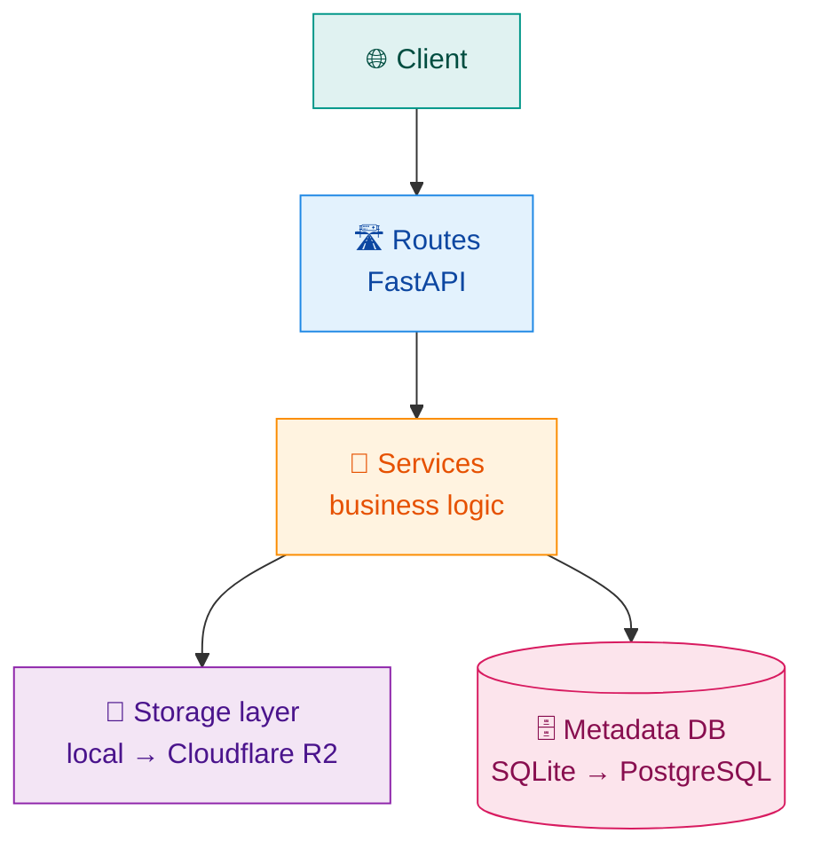

<div align="center">

# ⚡ QuickShare

### Share files instantly. No accounts. No exposure. Just a code.

<br/>


<br/>

[About](#-about) · [Features](#-features) · [How it works](#how-it-works) · [Tech stack](#tech-stack) · [Roadmap](#roadmap) · [Run locally](#-run-locally)

</div>

---

## 📖 About

**QuickShare** is a lightweight file-sharing tool for the moment you just need to hand someone a file. Fast. Without logging into a personal account on a shared device, without exposing your private stuff, and without all the bloat modern file-sharing services pile on.

### 💡 Why I built this

A friend once had to log into their personal WhatsApp on a shared college smartboard just to download a presentation, and ended up exposing their private chats to the whole class. QuickShare exists so that never has to happen again.

**Upload a file → get a short code (and a QR code) → the other person enters it → they download. Done.**

It's inspired by tools like **iLovePDF**: visit, do the work, leave. No sign-up walls, no feature creep, no data harvesting.

| 🧑‍💻 Guests | 👤 Registered users *(planned)* |
| :--- | :--- |
| Up to **100 MB** per share | Longer expiry windows |
| Optional **password protection** | Higher limits |
| Expiry of **2–5 days** | Device tracking |
| Configurable **download limits** | Same frictionless core experience |

> [!NOTE]
> **Project status:** QuickShare is in active development. The backend API works and can be tested locally through the built-in API docs. The frontend is planned but not built yet.

---

## ✨ Features

### ✅ Implemented

| | Feature | What it does |
| :-: | :--- | :--- |
| 📤 | **Upload with unique code** | Upload one or more files in a single request and get a short, human-friendly 6-character code |
| 📦 | **Multi-file shares** | Batch multiple files (up to 100 MB combined) under one share code |
| 🧩 | **Streaming storage** | Files are read and written in chunks, so memory usage stays constant even for big uploads |
| 🗄️ | **Metadata persistence** | Share and file metadata live in async SQLite, while the actual bytes sit in a separate storage layer |
| 🔐 | **Password protection** | Optional, hashed with bcrypt. The plain password is never stored |
| ⏳ | **Configurable expiry** | Set an expiration window per share |
| 📥 | **Download limits** | Cap how many times a share can be downloaded |
| 🧱 | **Pluggable storage** | Local filesystem today, Cloudflare R2 tomorrow, with minimal changes |
| ⚙️ | **Centralized config** | Pydantic `BaseSettings` with `.env` support and cached access |
| 🧵 | **Dependency injection** | Session, storage and service instances wired through FastAPI's DI system |

### 🔜 Planned

- 📥 Download endpoint with streaming responses
- 🔑 Password prompt and verification flow on download
- 📱 QR code generation for share links
- 🧹 Background task to delete expired shares and orphaned files
- 👤 Optional user registration and login with JWT auth
- 📊 Device access tracking and device caps for logged-in users
- 🖥️ Minimal frontend (HTML + CSS + Vanilla JS) for upload and download
- ☁️ Cloudflare R2 storage backend for production
- 🐘 PostgreSQL support for production
- 🌐 Public deployment

---

<a id="how-it-works"></a>

## 🔄 How it works


### 🏗️ Architecture

The backend is layered, so routing, business logic, storage and persistence don't leak into each other.



---

<a id="tech-stack"></a>

## 🛠️ Tech stack

<div align="center">


<!-- 

 -->

</div>

| Layer | Technology |
| :--- | :--- |
| **Backend** | FastAPI |
| **ORM / Models** | SQLModel (SQLAlchemy + Pydantic) |
| **Database** | SQLite (dev) → PostgreSQL (prod) |
| **File storage** | Local filesystem (dev) → Cloudflare R2 (prod) |
| **Async runtime** | `asyncio`, `aiosqlite`, `aiofiles` |
| **Config** | `pydantic-settings` |
| **Security** | `bcrypt` |
| **API docs** | Scalar / OpenAPI |
| **Frontend** | Plain HTML + CSS + Vanilla JS *(planned)* |
| **Hosting** | Render / Railway (backend), Vercel (frontend) *(planned)* |

<details>
<summary><b>🧠 Concepts I practiced building this</b></summary>

<br/>

- **REST API design** with resource-oriented endpoints and proper HTTP status codes
- **Async-first architecture** using `async`/`await` across database, storage and route layers
- **Dependency injection** for sessions, storage and services: reusable, testable, swappable
- **Layered architecture** separating routing, business logic (services), storage and persistence
- **Storage abstraction** that isolates filesystem concerns from application logic
- **Schema-driven validation** with Pydantic models for requests and responses
- **Configuration as code** with `BaseSettings`, environment variables and cached settings
- **Streaming I/O** for uploading and (planned) downloading large files without loading them fully into memory
- **Transactional persistence** with SQLAlchemy sessions and relationship-driven inserts
- **Hashed credentials** with bcrypt, so sensitive data is never stored in plaintext

</details>

---

<a id="roadmap"></a>

## 🗺️ Roadmap

| Phase | Focus | Status |
| :-: | :--- | :-: |
| **1** | Core backend: upload, codes, multi-file shares, streaming storage, bcrypt passwords, expiry, download limits | ✅ Done |
| **2** | Download flow: streaming endpoint, password verification, QR codes | 🔨 Next |
| **3** | Cleanup: background task for expired shares and orphaned files | 📋 Planned |
| **4** | Frontend: upload and download pages in HTML + CSS + Vanilla JS | 📋 Planned |
| **5** | Accounts: optional registration, JWT auth, device tracking and caps | 📋 Planned |
| **6** | Production: Cloudflare R2, PostgreSQL, public deployment | 📋 Planned |

---

## 📸 Screenshots

> _Coming soon: a sneak peek of the upload flow via the API docs._

| Upload form | Response |
| :---: | :---: |
| `[Insert Screenshot Link Here]` | `[Insert Screenshot Link Here]` |

---

## 🧪 Run locally

There's no public deployment yet, so running it locally is currently the only way to try QuickShare. If you want to poke around the code or contribute, this is for you.

### Prerequisites

- **Python 3.11+**
- **Git**
- *(Optional)* `sqlite3` CLI for inspecting the database
- *(Optional)* A modern code editor like VS Code

### Setup

**1. Clone the repo**

```bash
git clone https://github.com/<your-username>/quickshare.git
cd quickshare
```

**2. Create and activate a virtual environment**

```bash
python -m venv venv
```

```bash
# Windows (PowerShell)
venv\Scripts\Activate.ps1

# macOS / Linux
source venv/bin/activate
```

**3. Install dependencies**

```bash
pip install -r requirements.txt
```

**4. Set up environment variables**

Copy the example file and tweak values as needed.

```bash
cp .env.example .env
```

**5. Start the dev server**

```bash
uvicorn app.main:app --reload
```

Then open the built-in API docs and try an upload.

---

## 📄 License

Released under the [MIT License](LICENSE).

<div align="center">

<br/>

⚡ **Visit. Share. Leave.** ⚡

<sub><a href="#-quickshare">⬆ Back to top</a></sub>

</div>